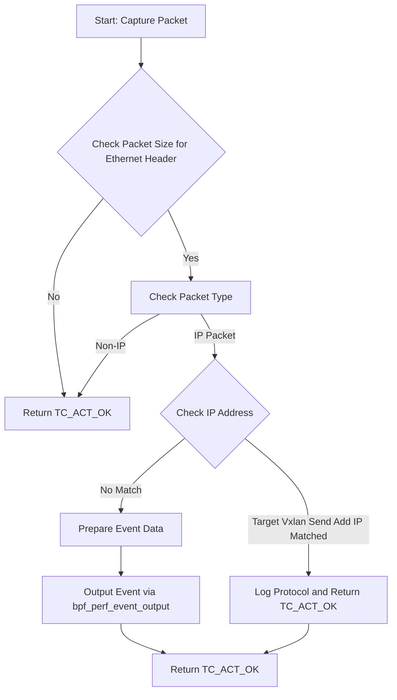
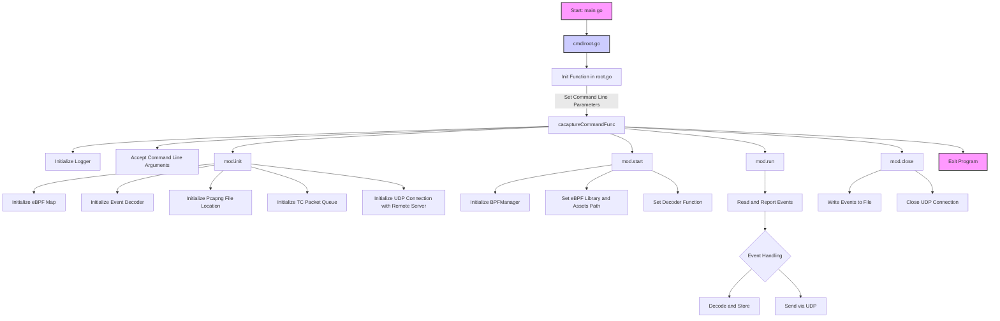

[TOC]


## ReadMe

### Prerequirement

1. ebpf 需要系统开启BTF, 确保系统符合以下要求之一

   - Ubuntu 20.10+
   - Fedora 31+
   - RHEL 8.2+
   - Debian 11+
   - Linux 4.9+，5.x is better

2. 确保/sys/kernel/btf/vmlinux存在，如果不存在说明系统未开启BTF，尝试升级内核版本

3. 安装必要的ebpf编译环境

   ```sh
   # For Ubuntu20.10+
   sudo apt-get install -y  make clang llvm libelf-dev libbpf-dev bpfcc-tools libbpfcc-dev linux-tools-$(uname -r) linux-headers-$(uname -r)
   
   # For RHEL8.2+
   sudo yum install libbpf-devel make clang llvm elfutils-libelf-devel bpftool bcc-tools bcc-devel
   ```

4. 安装go：https://golang.google.cn/doc/install

### Running

1. 安装go 所需要的包

   ```sh
   # 设置go代理
   go env -w  GOPROXY=https://goproxy.io,direct
   
   # 安装go所需要的包
   cd cacapture
   go mod tidy
   ```

2. 生成vmlinux.h 至kern/vmlinux.h

   ```sh
   make vmlinux
   ```

3. 生成ebpf库文件

   ```
   make tc
   ```

4. 生成asset

   ```sh
   make asset-tc
   ```

5. 生成可执行文件

   ```sh
   go build .
   ```

6. 执行文件

   ```sh
   sudo ./cacapture --Mode="Containerd" --PodName="nginx-7c5ddbdf54-thq4v,nginx-7c5ddbdf54-52j2w,nginx-7c5ddbdf54-7gwbh,nginx-7c5ddbdf54-s4dgr,nginx-7c5ddbdf54-gszml" --PodNsName default --Sentnet
   ```

   以下是flags的说明

   - mapsize： eBPF map size, 既内核缓冲区大小
   - Mode：Containerd表示k8s, Docker表示 docker
   - ContainerID： 指定监视的容器ID
   - PodName：指定监视的Pod名称，多个PodName请用空格隔开，形成一个string
   - PodNsName：指定监视的Pod的Ns名称
   - Ifname：监视的网卡名称，如果不指定，若mode为Docker,则为Docker容器内部第一块不为lo的网卡，如果是k8s 容器将会根据ip地址自动匹配网卡
   - Sentnet：false则保存本地，ture则转发到远端服务器
   - DstIP/DstPort：转发远端服务器地址，DstPort通常为4789


### Code Example

1. 监听某个docker容器中的某个网卡，并发送给默认远端

   ```sh
   sudo ./cacapture --Mode="Docker" --ContainerID "21698c7f28c5" --Ifname eth0 --Sentnet
   ```

2. 监听某个docker容器中的某个网卡，并发送给指定远端

   ```sh
   sudo ./cacapture --Mode="Docker" --ContainerID "21698c7f28c5" --Ifname eth0 --Sentnet DstIP 172.1.4.2 DstPort 8888
   ```

3. 监听k8s的某个ns下的某些pod，并发送给默认远端

   ```sh
   sudo ./cacapture --Mode="Containerd" --PodName="nginx-7c5ddbdf54-thq4v,nginx-7c5ddbdf54-52j2w,nginx-7c5ddbdf54-7gwbh,nginx-7c5ddbdf54-s4dgr,nginx-7c5ddbdf54-gszml" --PodNsName default --Sentnet
   ```

4. 监听k8s的某个ns下的全部pod，并发送给默认远端

   ```sh
   sudo ./cacapture --Mode="Containerd" --PodName="all" --PodNsName default --Sentnet
   ```

   


### Code Explain

#### Kernel eBPF code



- 所处位置：kern/tc.bpf/c
- 钩子函数：
  - egress_cls_func
  - infress_cls_func
- target_ip:指发送数据的接受方ip,使用vxlan格式发送，对于这部分数据我们并不记录

#### User Go Code



- 所处位置：user
- 核心文件：
  - probe_container_pcap.go
  - probe_tc.go

### 其他说明

- 微调，加载，使用LLM用于解决dcling 的问答问题：[看这里](others/readme_FinetuneModel.md)
- 关于deepflow的移植问题：[看这里]()